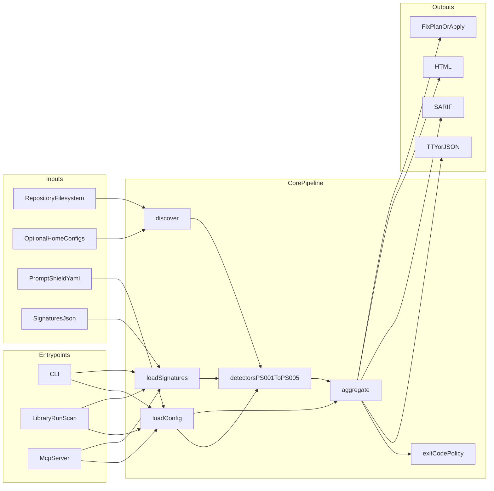

# PromptShield Engineering Runbook

Internal handoff guide for maintaining, extending, and operating PromptShield.

## 1. Architecture overview

### 1.1 Purpose

PromptShield scans AI assistant configuration surfaces (IBM Bob, Claude Code, Cursor) and GitHub workflow files for known exploit classes. It discovers relevant files, runs detectors (PS-001..PS-005), aggregates and filters findings, then exposes results through CLI, library API, and MCP.

### 1.2 Pipeline

1. Resolve root directory.
2. Load config (`.promptshield.yaml` / `.promptshield.yml`).
3. Load signatures (`src/signatures/signatures.json`).
4. Discover candidate files.
5. Run detectors.
6. Aggregate, dedupe, override severity, and ignore.
7. Compute exit code (`high`+ findings fail by default).
8. Render output (TTY/JSON/SARIF/HTML) and optional fix plan/apply.

### 1.3 Runtime stack

- TypeScript (ESM, NodeNext)
- tsup build (`dist/cli.js`, `dist/index.js`)
- commander CLI
- fast-glob discovery
- yaml + jsonc-parser loading
- MCP SDK server (stdio transport)
- zod MCP input schemas

### 1.4 Data flow

## 2. Repository map

- Core orchestration: [`src/core/`](../src/core)
- Detectors: [`src/detectors/`](../src/detectors)
- MCP server: [`src/mcp/server.ts`](../src/mcp/server.ts)
- CLI + renderers: [`src/cli/`](../src/cli)
- Utilities: [`src/utils/`](../src/utils)
- Types: [`src/types/`](../src/types)
- Signature DB: [`src/signatures/signatures.json`](../src/signatures/signatures.json)

## 3. Core modules

### 3.1 Discoverer

[`src/core/discoverer.ts`](../src/core/discoverer.ts) finds:

- Bob: `.bob/custom_modes.{yaml,yml}`, `.bob/mcp.json`, `.bob/skills/*/SKILL.md`, `.bob/rules-*/*.md`
- Claude: `.claude/settings*.json`, `.claude/skills/*/SKILL.md`, `.mcp.json`, `.claude/mcp.json`
- Cursor: `.cursor/settings.json`, `.cursorrules`, `.cursor/rules/*.md`, `.cursor/mcp.json`
- CI workflows: `.github/workflows/*.{yml,yaml}`

Optional `--include-home` extends to known files under `~/.bob`, `~/.claude`, `~/.cursor`.

### 3.2 Scanner

[`src/core/scanner.ts`](../src/core/scanner.ts):

- loads config + signatures,
- discovers files,
- runs filtered detector set,
- captures detector exceptions into `detectorErrors`,
- aggregates findings and computes final exit code.

### 3.3 Aggregator

[`src/core/aggregator.ts`](../src/core/aggregator.ts):

- dedupes by fingerprint,
- applies `severityOverrides`,
- applies `ignore` rules with regex path matching,
- sorts findings by severity and file.

### 3.4 Fixer

[`src/core/fixer.ts`](../src/core/fixer.ts):

- PS-001 auto-fix: remove dangerous allowlist entry lines.
- PS-005 auto-fix: insert hardening comment in workflow.
- emits preview patch text; optional in-place apply.

## 4. Detector deep dive

### PS-001 Chained-command bypass

File: [`src/detectors/chained-command-bypass.ts`](../src/detectors/chained-command-bypass.ts)

- flags dangerous bare utilities in Bob/Claude/Cursor allowlists,
- flags process-substitution `>(...)` in prose/rule files.

### PS-002 Toxic skill scanner

File: [`src/detectors/toxic-skill-scanner.ts`](../src/detectors/toxic-skill-scanner.ts)

- signature matching from `signatures.json`,
- base64 frontmatter heuristic,
- over-broad allowed-tools + missing/narrow regex checks.

### PS-003 MCP stdio RCE

File: [`src/detectors/mcp-stdio-rce.ts`](../src/detectors/mcp-stdio-rce.ts)

- interpolation in command/url,
- shell `-c` usage,
- shell metachar args,
- untrusted server source checks against `mcp.trusted_servers`.

### PS-004 Custom-mode privilege escalation

File: [`src/detectors/custom-mode-priv-esc.ts`](../src/detectors/custom-mode-priv-esc.ts)

- Bob custom modes with broad capability and missing `rules-<slug>/`,
- Claude skills with broad allowed tools and no narrow file regex,
- supports both `fileRegex` and `file_regex`.

### PS-005 Comment-and-Control workflow

File: [`src/detectors/comment-and-control-workflow.ts`](../src/detectors/comment-and-control-workflow.ts)

- finds AI CLI invocation in workflows fed by untrusted PR/comment context,
- severity scoring based on guards and trigger type (`pull_request_target` risk).

## 5. CLI and MCP contracts

### 5.1 CLI commands

File: [`src/cli/index.ts`](../src/cli/index.ts)

- `scan` (default): JSON/SARIF/HTML filters, include-home, exit controls
- `fix`: dry-run default, optional `--apply`
- `list-detectors`
- global `--mcp` starts stdio MCP server

### 5.2 MCP tools

File: [`src/mcp/server.ts`](../src/mcp/server.ts)

- `scan_project`
- `list_detectors`
- `explain_finding`
- `apply_fix`

Operational rule: only auto-allow read-only tools (`scan_project`, `list_detectors`, `explain_finding`); keep `apply_fix` approval-gated.

## 6. Build, CI, and release

### 6.1 Build and typecheck

- `npm ci`
- `npm run typecheck`
- `npm run build`

### 6.2 CI

File: [`/.github/workflows/ci.yml`](../.github/workflows/ci.yml)

- Matrix typecheck/build
- Self-scan with SARIF upload (`--exit-zero` to always emit SARIF)

### 6.3 Publish guard

`prepublishOnly` enforces typecheck + build + lint before release.

## 7. Troubleshooting

- **No findings expected but none returned:** verify scan root and ignore rules.
- **Unexpected detector errors:** inspect `detectorErrors` in JSON output.
- **MCP not discovered in Bob:** verify absolute path in MCP config and restart Bob.
- **Fingerprint explain misses:** `explain_finding` rescans; fingerprints can change if files changed.
- **Auto-fix changed JSON formatting:** review generated patch and resulting JSON arrays.

## 8. Operational references

- Main usage: [`README.md`](../README.md)
- Bob walkthrough: [`docs/RUNNING_WITH_BOB.md`](./RUNNING_WITH_BOB.md)
- Validation generator: [`scripts/generate-validation-workspaces.mjs`](../scripts/generate-validation-workspaces.mjs)
